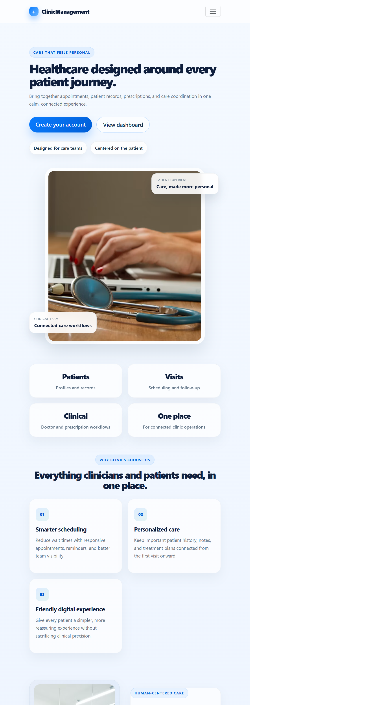
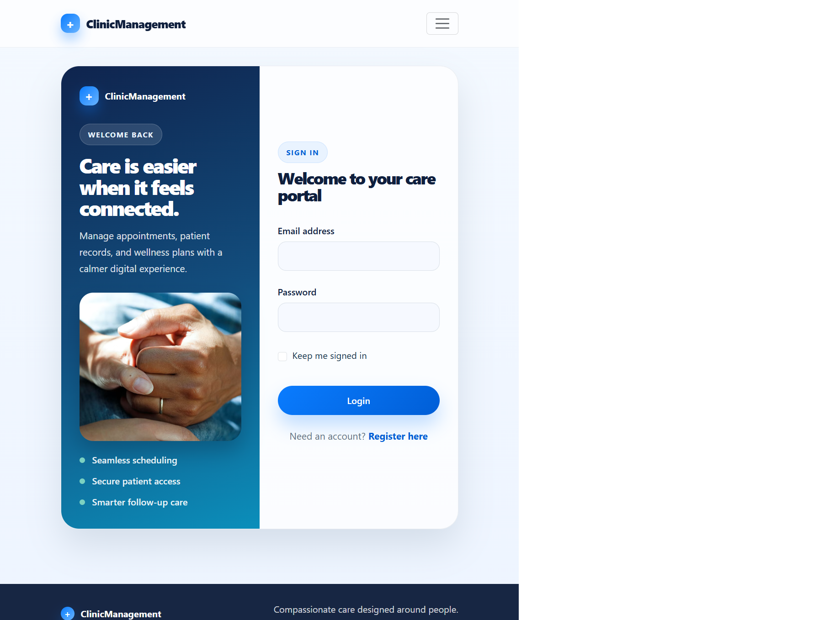

# ClinicCare – Clinic Management System

ClinicCare is a clinic management web application built with ASP.NET Core MVC and .NET 9. It brings patient and doctor records, appointments, prescriptions, and role-based access together in a server-rendered web application.

## Features

- User registration and login with ASP.NET Core Identity.
- Role-based authorization for Admin, Doctor, Receptionist, and Patient users.
- Patient and doctor create, read, update, and delete workflows.
- Appointment scheduling, details, and status management.
- Prescription creation with multiple medicines per prescription.
- Prescription details and a PDF prescription generation service.
- MVC model validation and dependency injection.
- SQL Server integration with Entity Framework Core migrations.
- Email service structure and SMTP integration are prepared. Automatic prescription email delivery has not been confirmed as complete.

## Technologies

- C# and .NET 9
- ASP.NET Core MVC and Razor Views
- Entity Framework Core and SQL Server
- ASP.NET Core Identity
- Bootstrap and LINQ
- QuestPDF
- MailKit
- Git and GitHub

## User roles

| Role | Intended access |
| --- | --- |
| Admin | Clinic administration and management workflows |
| Doctor | Patient care, appointments, and prescription workflows |
| Receptionist | Patient records and appointment scheduling |
| Patient | Personal appointments and prescription information |

Access is enforced by the application's authorization policies and controller actions.

## Project structure

```text
ClinicManagement/
├── Controllers/
├── Data/
├── Migrations/
├── Models/
├── Services/
├── ViewModels/
├── Views/
├── wwwroot/
├── Program.cs
├── appsettings.json
└── ClinicManagement.csproj
```

## Local setup

### Prerequisites

- .NET 9 SDK
- SQL Server LocalDB or another SQL Server instance
- The .NET Entity Framework command-line tool for migration commands

### Configure the database

The checked-in `appsettings.json` is intended for a local, password-free development connection. To use another database, set `ConnectionStrings:DefaultConnection` through an environment variable or User Secrets rather than committing credentials:

```powershell
$env:ConnectionStrings__DefaultConnection = "your-local-connection-string"
```

For credentials used only on your development machine, initialize User Secrets and configure the setting there:

```powershell
dotnet user-secrets init
dotnet user-secrets set "ConnectionStrings:DefaultConnection" "your-local-connection-string"
```

### Restore, migrate, and run

Run these commands from the project directory:

```powershell
dotnet restore
dotnet tool install --global dotnet-ef
dotnet ef database update
dotnet run
```

If `dotnet-ef` is already installed, update it as needed to a version compatible with the project's Entity Framework Core packages. The app uses the `DefaultConnection` connection string.

To add a future migration after changing the data model:

```powershell
dotnet ef migrations add MigrationName
dotnet ef database update
```

Email settings are bound from the `EmailSettings` configuration section. Keep SMTP credentials outside tracked files, using User Secrets locally or a secure environment-specific configuration provider. The development settings file is intentionally excluded from Git.

## Security notes

- Do not commit passwords, SMTP or Gmail App Passwords, API keys, access tokens, or production database credentials.
- Keep local overrides in User Secrets or environment variables. User Secrets are local developer configuration and are not a deployment secrets store.
- `appsettings.Development.json`, local database files, and build output are excluded by `.gitignore`.
- Configure production secrets with a secure deployment configuration provider before deploying.

## Screenshots

### Homepage



### Login



Additional screenshots can be added to `docs/screenshots/` as they are captured:

- [Login](docs/screenshots/login.png)
- [Admin dashboard](docs/screenshots/admin-dashboard.png)
- [Patients](docs/screenshots/patients.png)
- [Doctors](docs/screenshots/doctors.png)
- [Appointments](docs/screenshots/appointments.png)
- [Prescription](docs/screenshots/prescription.png)
- [Access denied](docs/screenshots/access-denied.png)

## Demo Video

The project demonstration video will be added here.

## Future improvements

- Add and verify automated tests for critical workflows.
- Complete and verify end-to-end SMTP notification workflows before describing them as available.
- Add production deployment guidance and deployment-specific secret management.
- Add screenshots and a project demonstration video.
